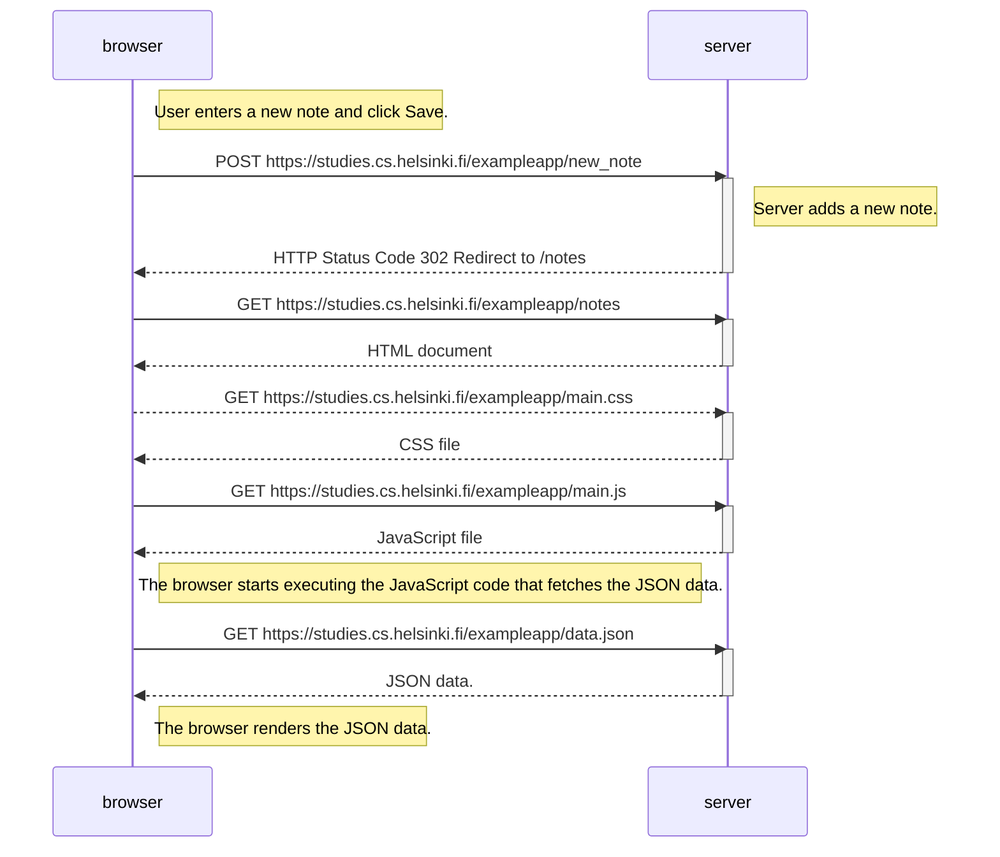

```mermaid
sequenceDiagram
    participant browser
    participant server

    note right of browser: User enters a new note and click Save.
    browser->>server: POST https://studies.cs.helsinki.fi/exampleapp/new_note
    activate server
    note right of server: Server adds a new note.
    server-->>browser: HTTP Status Code 302 Redirect to /notes
    deactivate server
    
    browser->>server: GET https://studies.cs.helsinki.fi/exampleapp/notes
    activate server
    server-->>browser: HTML document
    deactivate server

    browser-->>server: GET https://studies.cs.helsinki.fi/exampleapp/main.css
    activate server
    server-->>browser: CSS file
    deactivate server

    browser->>server: GET https://studies.cs.helsinki.fi/exampleapp/main.js
    activate server
    server-->>browser: JavaScript file
    deactivate server
    note right of browser: The browser starts executing the JavaScript code that fetches the JSON data.

    browser->>server: GET https://studies.cs.helsinki.fi/exampleapp/data.json
    activate server
    server-->>browser: JSON data.
    deactivate server
    note right of browser: The browser renders the JSON data.
    
```
